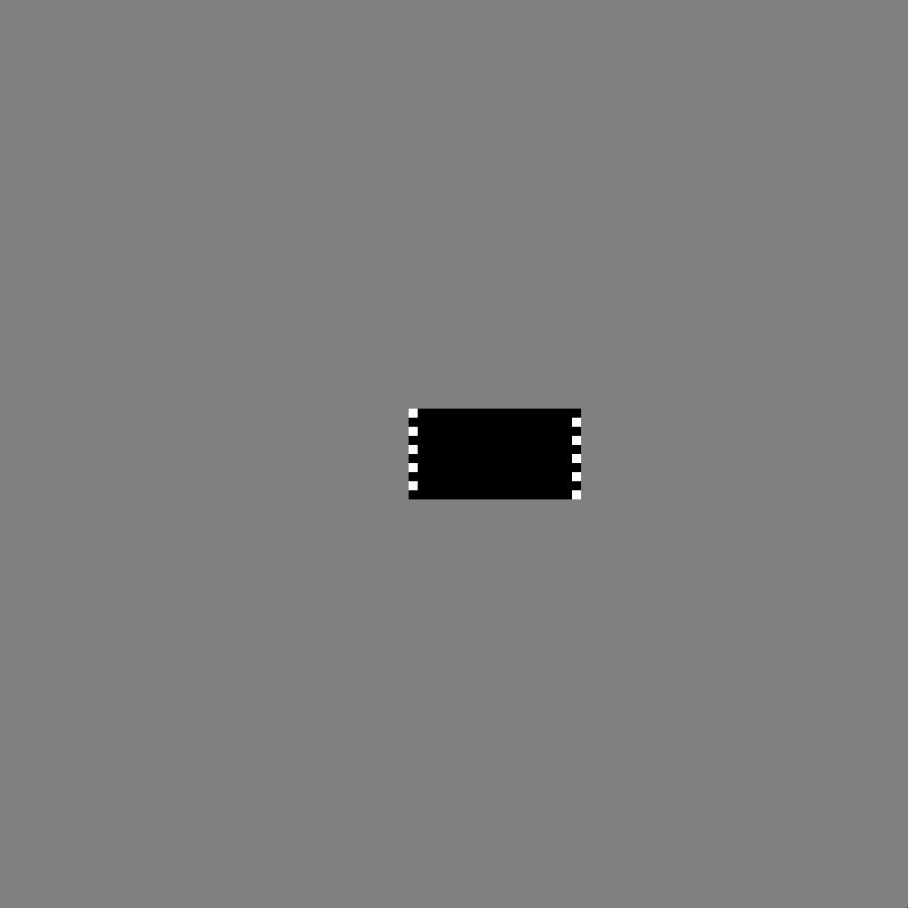

# glamm
(Open)GL Accelerated Map Merging (GLAMM)

## Dependencies

- `libgles-dev` OpenGL 3.2 ES for shaders
- `libglm-dev` for math
- `libegl-dev` for X11-less rendering
- `libgbm-dev` for Linux's Generic Buffer Manager

## How does it work?

0. Maps (textures) are merged sequentially to a framebuffer.
1. Vertex shader computes screen coordinates from map properties (location, orientation, world size).
2. Fragment shader merges map with previously merged maps in the framebuffer via the implemented merge policy.
3. (Optional) Merged map in the framebuffer can be saved to file. 

## What do the shaders do?

1. `BlitMapsShader` merges the newest map with the previously merged maps.

## What are the maps?

Maps are stored in the PGM format in this example and loaded from the filesystem as a texture. Each pixel is interpreted as a cell of the occupancy grid map. Maps are assumed to have the following properties:

1. Occupancy grid maps have three values: occupied (1.0), free (0.0), and unknown (0.5); R-channel only
2. Maps have a `(x,y)` position that is at the center of the map
3. The merged map has `(0,0)` at the center of the map
4. Each pixel is a cell at the resolution of the merged map (highest resolution). Maps are sized at the same resolution, but can have smaller (lower resolution) or equally sized textures.

## How do I build and try an example?

```
sudo apt install libgles-dev libglm-dev libegl-dev libgbm-dev
mkdir build && cd build
cmake ../
# if necessary, edit device url at main.cpp:83, default is /dev/dri/card0
make
./glammer
eog ./output.pgm
```

Below is the output of merging 10 10x10 chessboards, where each chessboard is moved to the right by one square. The merge policy will persist all obstacles (black square) even if a new map provides free space (white square) over an existing obstacle (black square). Consequently, all overlapping columns (first and last are non-overlapping) are completely occupied (black squares).



## How do I customize the merge policy?

`glamm/shaders/blit_maps.fs` is the fragment shader and determines the output (merged) color based on the new map (`input_texture`) and previously merged texture (`output_texture`). Change the logic in this shader to provide your own merge policy.
